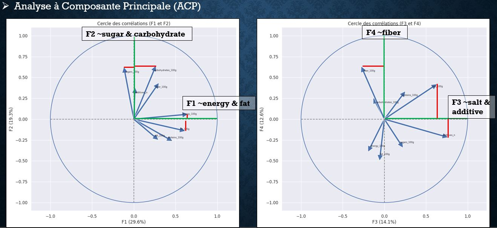

# Analyse-multivari-e-data_p3
Livrables réalisés pour le projet "Préparez des données pour un organisme de santé publique" (projet n°3) OpenClassroom.

### Contexte projet de formation professionnalisant :

L'agence Santé publique France souhaite améliorer la base de données Open Food Facts, une ressource open source permettant de connaître la qualité nutritionnelle des produits.

### Problématique :
L'ajout de nouveaux produits à la base de données nécessite la saisie de nombreux champs, entraînant des erreurs et des valeurs manquantes.

### Mission :
Votre entreprise est chargée de créer un système de suggestion ou d'auto-complétion pour faciliter cette saisie.
Vous devez d'abord nettoyer et explorer les données pour évaluer la faisabilité de cette solution.

### Étapes réalisées :
* Traitement des données :
  * Identification des variables pertinentes.
  * Nettoyage des données : détection et traitement des valeurs manquantes et aberrantes.
  * Automatisation du processus pour gérer les modifications futures de la base de données.
* Analyse exploratoire :
  * Visualisation et analyse univariée des variables intéressantes.
  * Production de graphiques variés pour illustrer les résultats.
* Analyse multivariée :
  * Création et sélection de variables.
  * Tests statistiques pour valider les résultats.
* Rédaction d'un rapport :
  * Présentation de la faisabilité de l'application demandée.
* Conformité RGPD :
  * Explication des principes du RGPD appliqués au projet pour rassurer le public
 
